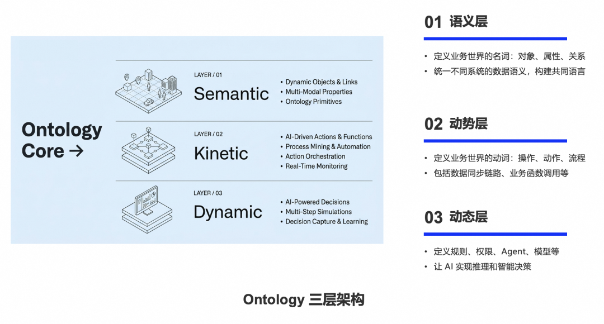
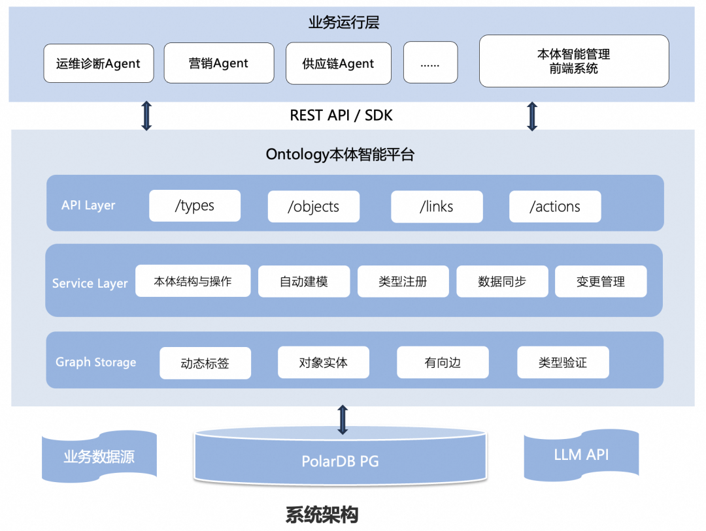
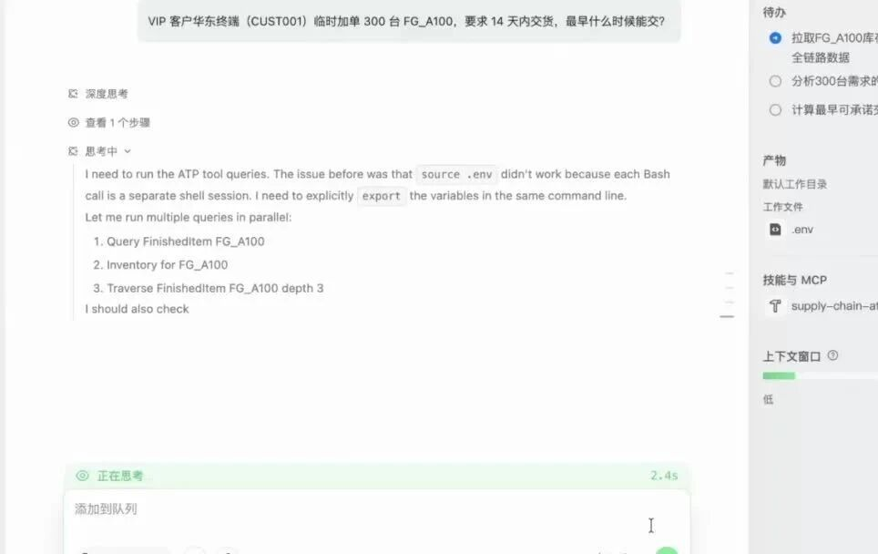
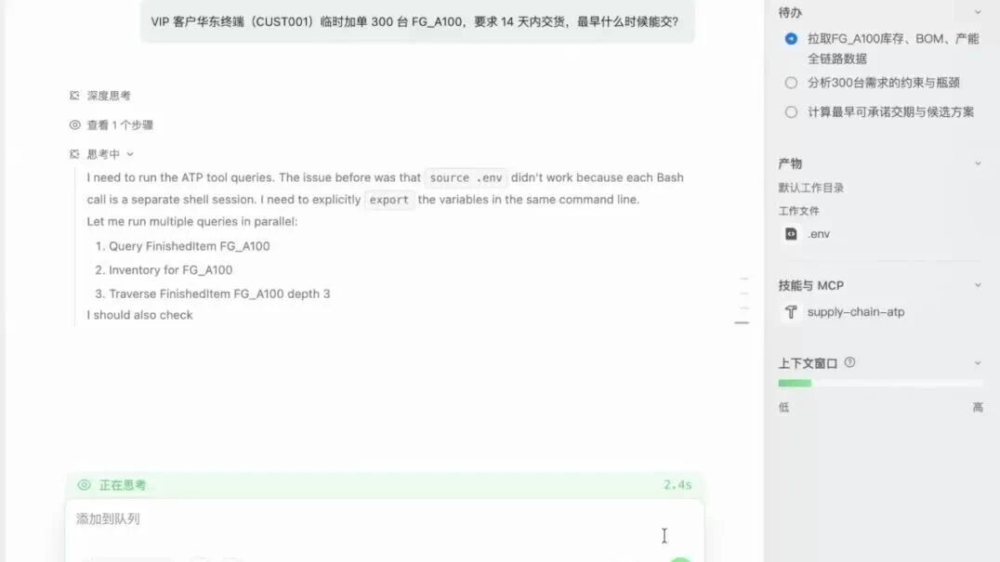

# Ontological Engineering：基于PolarDB-PG智能本体引擎实现“数据驱动”到“决策中心”

原创 PolarDB-PG团队 阿里云开发者

*2026年4月23日 16:48*

从哲学概念到企业智能

Ontology一词源自哲学，由希腊语"ontos"（存在）与"logos"（学说）组成。在人工智能领域，Ontology是对现实世界的抽象，通过对企业中"对象—关系—行为"的建模，构建"知识图谱+业务逻辑引擎"体系，让数据与业务建立可操作、可推理的连接。

举个例子：航空公司分析航班延误原因。传统方法需分别调取维护记录、气象数据、登机统计再手动比对。而在Ontology系统中，"航班""飞机""天气""地勤人员"等对象已被定义并建立逻辑关系。分析师只需提问，系统即给出可视化因果链，甚至触发"调用备用飞机"动作。Ontology不仅理解数据含义，还理解数据间关系，并能直接指导行动。

面对的挑战

过去两年，大语言模型（LLM）的能力飞速进化，AI Agent正在从实验室走向企业的生产环境。运维诊断、供应链决策、营销服务……越来越多的严肃业务场景开始尝试引入Agent来提升效率。然而，真正落地时，企业仍然面临以下核心挑战：

语义模糊与业务理解缺失：通用大模型虽然"博学"，但在面对企业特定的业务场景时，往往显得"水土不服"。通用模型仅依赖表层上下文，缺乏确定性的企业级语义理解。例如，同一个"客户"概念，在CRM、ERP和财务系统中可能指代完全不同的实体或状态。

逻辑幻觉与执行不可靠：这是企业级应用最致命的痛点。大模型擅长生成听起来合理的答案，但对企业内部强约束、强规则的业务逻辑缺乏真正理解。在长链条任务中，一步推理错误可能导致"步步错"，甚至引发系统失控。传统的"黑盒"推理难以满足企业合规、安全、可管控的要求。

为此，PolarDB PostgreSQL版（以下简称PolarDB-PG）产品中嵌入了智能本体引擎，提供了一套轻量级的Ontology智能平台。

什么是Ontology？——Agent的语义内核

我们借鉴Palantir的核心技术哲学：不直接让模型理解Raw Data，而是在数据之上建立"语义层"。

**三层架构**

-   语义层：定义业务世界的"名词"——对象、属性与关系，统一不同系统的数据语义。
    
-   数据流转层：定义业务世界的"动词"——操作、动作与流程，涵盖数据同步链路和业务函数调用。
    
-   智能决策层：定义规则、权限、Agent与模型的绑定关系，让AI得以进行推理和智能决策。

**三大核心要素**

对象（Objects）：数据不再是冰冷的表、行、列，而是带有属性、行为、历史和约束的业务实体。例如，数据库实例不再是`pg_stat`表中的一行，而是完整的`DatabaseInstance`对象，拥有CPU核数、所属团队、当前状态、历史告警等丰富属性。

链接（Links）：对象间关系被显式定义，构成知识图谱。`Database → Deploys_To → Cloud Region`、`Service → Depends_On → Database`——这些关系让Agent能像人类专家一样沿拓扑结构多跳推理。

动作（Actions）：预定义的可执行业务操作，如`RollbackDeployment()`。每个动作都有明确的输入参数、前置条件和执行效果。Actions本质是标准化API调用，Agent直接调用即可，安全高效。

**从RAG到OAG：检索范式的代际提升**

这三者结合，为Agent提供统一的结构化上下文。我们将这种检索方式称为OAG（Ontology-Augmented Generation），区别于传统RAG：

|     |     |     |
| --- | --- | --- |
| 特性  | 传统RAG | OAG |
| 检索内容 | 零散文本片段 | 结构化实体及关系网络 |
| 上下文质量 | 噪声大、关联弱 | 精准、完整、可追溯 |
| 推理能力 | 基于文本猜测 | 基于拓扑多跳推理 |
| 可解释性 | 低   | 高   |

传统RAG返回零散文本片段，上下文噪声大；OAG检索结构化实体及其关系网络，为LLM提供精准、完整、可追溯的上下文。

轻量级Ontology智能平台架构

从概念到落地，核心设计理念是：通用、轻量、低成本。

在基础设施层面，整个平台直接构建在PolarDB-PG之上，不需要额外部署Neo4j、JanusGraph等独立的图数据库。PolarDB-PG的强大关系型与多模存储能力，结合Polar\_AGE（图引擎）和PGVector（向量检索），已经能够提供混合负载所需的全部支撑。这意味着企业可以复用现有的技术栈，显著降低落地成本和运维复杂度。

在平台定位上，系统不绑定特定业务场景，可以广泛支持运维诊断、情报分析、供应链管理、CRM等多种Agent的集成需求。

**系统核心能力**

LLM驱动的自动建模：构建Ontology模型听起来门槛很高，但自动建模能力极大地降低了这一门槛。系统能够自动内省现有的PG数据库Schema，通过LLM智能推断并生成初步的Object、Link、Action定义，自动补充中文描述、推荐相关动作、标注敏感字段。数据同步采用批量直写与流式处理相结合，应对千万级大表，确保同步不中断业务。同步机制采用两阶段策略——先同步节点再同步关系——有效保证图数据引用的完整性。

[▶点击观看微信视频](https://mp.weixin.qq.com/s/6iI1gIW4HGh3G5FvM5zcWA)

供应链场景自动本体建模

细粒度权限治理（ACR）：权限治理是企业级Agent安全合规落地的前提。ACR机制提供：对象/属性级隔离，可基于字段自动进行数据分区；角色层级体系，内置admin、dev、viewer等角色；SQL级权限注入，在图遍历时自动剪枝不可见节点，兼顾安全与性能。

Action框架与人机协同：Agent执行操作的安全性至关重要。高危动作自动进入pending状态等待人工审批；Action执行后，系统根据预定义规则自动更新对象状态，形成状态闭环。内置Webhook对接CI/CD、工单和IM系统，全量操作审计满足合规要求。

高效图+向量融合检索与推理：基于PolarDB-PG高度优化的Polar\_AGE图引擎，平台无需额外部署独立的图数据库，即可支持从任意节点出发的多跳遍历（traverse）和两点间路径查找（path）——Agent可以像人类专家一样沿着拓扑关系逐跳推理。权限过滤直接嵌入查询过程（ACR-aware traversal），不可见节点在遍历中即时被剪枝，无需全量遍历后再过滤，安全与性能兼得。同时，通过对Object的属性和描述在图上直接定义embedding向量，平台还支持自然语言的语义匹配检索，实现图与向量检索的融合查询与推理。

**Skill：连接 Ontology 与 Agent 的桥梁**

Skill 自动生成。平台提供完整的技能全生命周期管理能力，包括 Skill 的创建、编辑、删除、查询，以及搜索和分类过滤；内置预设技能包，支持一键导入。平台在本体中生成好对象-关系-动作后，支持自动将其转化为 Agent 可调用的 Skill，无需手动编写。大幅降低了从"业务建模"到"Agent 可用"之间的衔接成本。

与 Agent 结合使用。声明式 Skill，即插即用，一个 Skill 文件即可告诉 Agent 如何调用 Ontology API（query、traverse、path、action），Agent 据此自主进行"证据驱动的探索式推理"，无需额外编码；同一套 Skill 框架适用于运维诊断、销售分析、IT 资产管理等各类场景，只需切换 Dataset。

本体平台将业务建模自动转化为 Agent 可调用的 Skill，实现了从"业务定义"到"Agent 执行"的自动化闭环，以声明式、配置化的方式大幅降低了 Agent 落地的技术门槛和成本。

实战案例：供应链分析与决策

展示PolarDB-PG Ontology平台在供应链复杂场景中的自动化、高效分析与推理决策能力。

Query：VIP客户华东终端（CUST001)临时加单300台FG\_A100，要求 14 天内交货，最早什么时候能交？

本案例采用传统计算推理方案至少需要3个人为期一天的工作，我们基于本体图谱数据，采用QoderWork + Skill的作业方式，进行供应链本体图谱的完整推理分析，几分钟即可出结果。系统会给出数据摘要、约束和瓶颈分析，包括候选方案、推荐方案和理由，并由人工选择方案后最后触发预定义Action形成业务决策闭环。

[▶点击观看微信视频](https://mp.weixin.qq.com/s/6iI1gIW4HGh3G5FvM5zcWA)

供应链场景基于QoderWork + Skill + 本体图谱开展业务分析与决策

更多应用场景

PolarDB-PG的Ontology智能平台可广泛适用于业务逻辑复杂、且对决策准确性与可解释性有严苛要求的场景：

自动驾驶长尾场景挖掘：关联车辆传感器、路况、驾驶行为等多模态数据，构建驾驶场景本体。AI基于本体逻辑（如“雨天+夜间+急刹”）主动挖掘罕见但关键的Corner Case（极端场景），加速算法迭代与安全性验证。

高端制造智能运维：将设备、工艺、质量数据关联，固化专家排查逻辑。AI能精准回溯故障根因，实现预测性维护，大幅缩短定位时间，解决经验难以复制的痛点。

精准营销与体验：整合交易、行为、服务数据，构建客户全景视图。AI通过推理发现隐性流失风险或潜在需求，驱动个性化策略生成，提升转化率与满意度。

Ontology企业最佳实践的切入方式是针对具体业务场景，解决目标十分明确的具体问题，不求大而全。

结语

回顾整个方案，PolarDB-PG Ontology致力于实现三个核心理念：首先，推动从RAG到OAG的提升跨越，以结构化实体网络取代零散文本，确保Agent上下文的精准性；其次，以灵活的语义边界替代僵化的固定流程，赋予LLM在安全约束下的自主决策的中心；最后，基于PolarDB-PG构建低成本、轻量级的架构，复用现有技术栈降低门槛。我们的终极目标，是让每个企业都能拥有自己的“Palantir Lite”。
