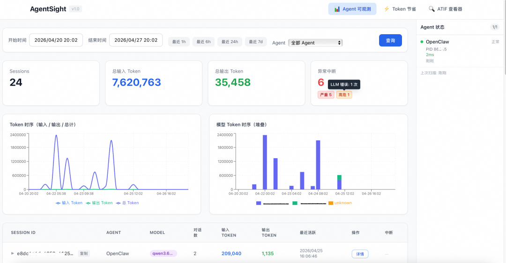
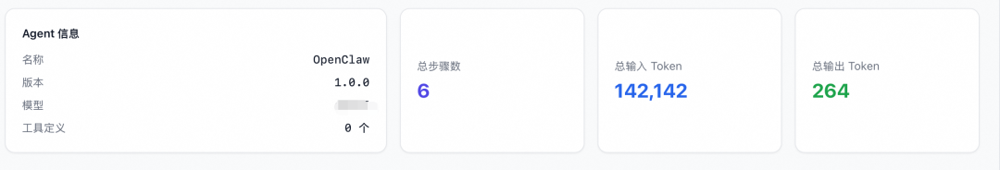
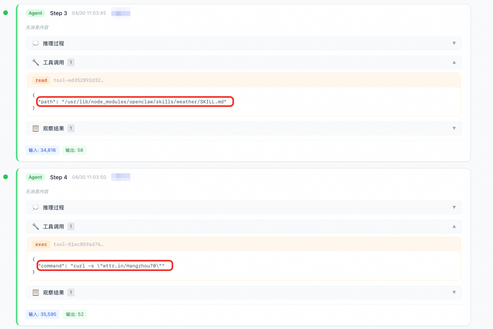
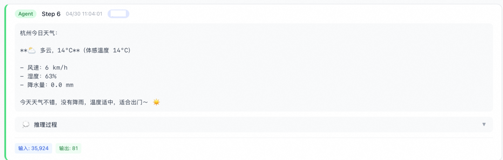
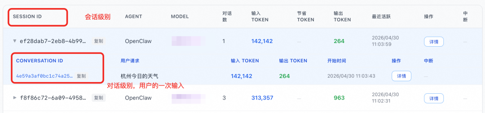
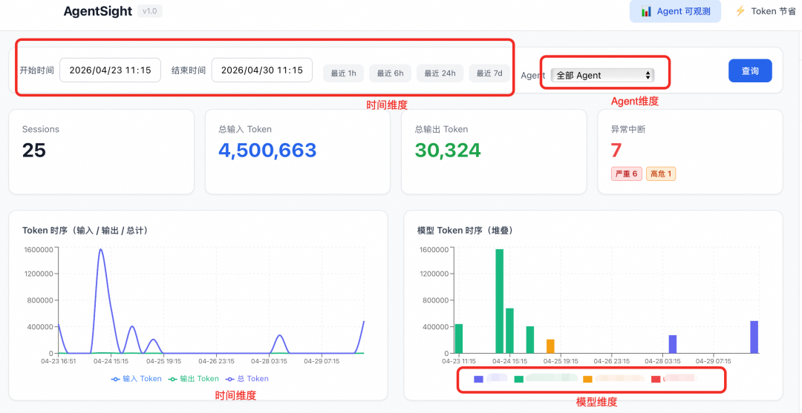
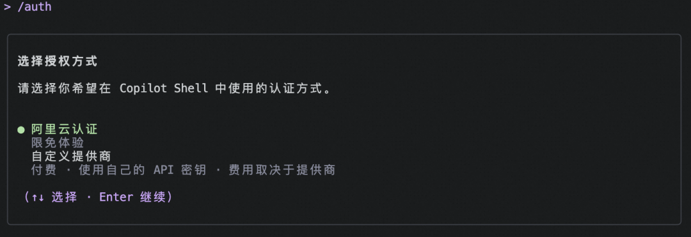
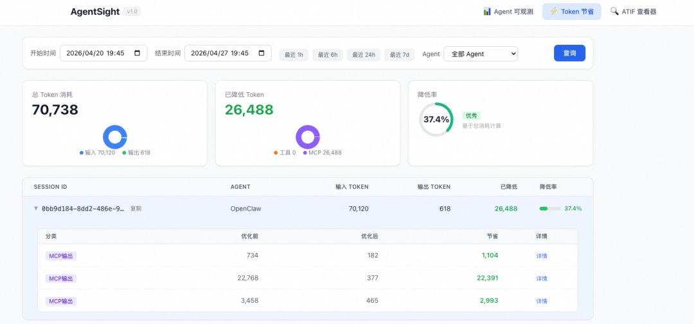
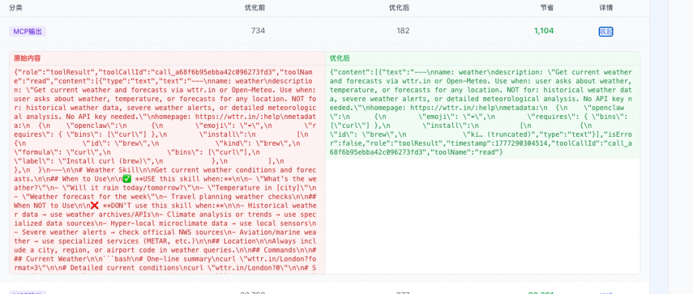

# Agent 烧钱如流水？Agentic OS (ANOLISA) 帮你逐笔看清 Token 账单

ANOLISA Team 阿里云开发者

*2026年5月11日 18:26*


阿里妹导读

文章内容基于作者个人技术实践与独立思考，旨在分享经验，仅代表个人观点。

自3月30日[阿里云发布首个面向 Agent 的操作系统——Agentic OS](https://mp.weixin.qq.com/s?__biz=MzIzOTU0NTQ0MA==&mid=2247559278&idx=1&sn=9378eac9dda09cdb5cbb5dbb129b5f47&scene=21#wechat_redirect) 以来，我们收到了许多用户的热烈反馈。其中，被提及频率最高的莫过于“我怎么才能去极致降低 Token 消耗？”这个问题的背后其实是多个小问题：Token 账单数字那么大，这些 Token 是哪个 Agent 花的？花在哪一步了？有没有浪费的？

浪费的无效 Token 是要节省的。而省无效 Token 的前提，是先看见 Token 花在了哪里。在过去，Token 消耗就是一个黑箱——你只知道月底的总数，不知道每一笔的去向。就像收到一张只写了合计金额的信用卡账单，你想省钱，但连哪笔该砍都不知道。

近期，Agentic OS（ANOLISA）上线了多重功能，其中 AgentSight 组件提供了能看清 Agent 全局状态和每笔 Token 去向的可视化面板。

AgentSight 是 Agentic OS（ANOLISA）的可观测组件，旨在解决 Agent 运行中 Token 消耗远超预期、用户缺乏感知与追溯手段的问题。它在零侵入业务逻辑的前提下，实现对 Agent 运行全链路的细粒度数据采集与关联分析。

---

一屏掌控：Agent 的健康和花销，不用再猜

你让 Agent 7×24 小时跑着，处理工单、执行巡检、回应请求。但你不可能 7×24 小时盯着它。这是 Agent 运维最基本的矛盾。

过去，你可能遇到过这些场景：Agent 在后台悄悄卡死了，你直到下一次打开终端才发现；关键任务中断了，没有任何人提醒你；Token 悄悄跑了几十万，月底账单才让你意识到成本失控。看不见，就无法管理。

AgentSight 组件的可视化面板把这些“看不见”变成了“一屏尽览”。打开面板，你能看到在 Agentic OS（ANOLISA） 上 Agent 的健康状态、活跃会话和异常中断——哪些在线、哪些离线、哪些正处于卡死状态。数据实时刷新，从全局概览到单个对话，信息层级清晰。



（图/AgentSight组件可视化面板）

当 Agent 离线或卡死时，AgentSight 不只是告诉你“出问题了”。它会自动发出告警，并支持触发重启，让 Agent 快速恢复运行——从发现到恢复，大幅减少人工介入。

Agent 的每一次心跳，你都看得见。出了问题，不用等第二天早上才知道。

---

Token 逐笔拆账：花了多少、花在哪、为什么花

你可能听过一句话：“不能度量的东西就无法优化。”Token 消耗也是如此。

**一个小案例——查看天气**

我们看一个让人大跌眼镜的小任务——查天气。

用户询问：“杭州的今日天气”。这是一个极其简单的单轮查询，预期的 Token 消耗应该非常低——用户输入不超过 20 个 Token，系统提示词在数百 Token 级别，一次工具调用加上响应也不过数千 Token。

但实际消耗是多少？花了 14 万 Token。但你无法分辨哪些是无效Token，以此来避免不必要的浪费。

通过AgentSight的可视化面板可以观察到 Token 消耗数数据，如下图所示。根据选用的模型不同花费的Token可能存在差异，但一般是输入Token远大于输出Token数下文中我们会继续分析，从而得知，绝大部分算力都浪费在了重复读取旧的历史记录上。



（图/AgentSight的可视化面板观察到的Token消耗数据）

**为什么会有如此巨大的消耗？**

我们通过AgentSight可视化界面可测到事件详情。从下图中可以看到，当用户询问“杭州今日天气”后，Agent 共产生了两次大模型调用，每个大模型调用的 Token 用量与耗时都清晰可查。每增加一次工具调用，历史消息就多“回放”一次，token 成本呈线性甚至超线性增长。下图中，两次工具调用分别查看了天气的skill并根据skill查询具体的天气，输入Token数越来越多，历史消息不断回放。



（图/调用过程）



（图/Agent输出结果）

AgentSight 组件将 Token 消耗按会话级和对话级两个维度进行拆解分析。通过这种粒度，用户可以清晰定位问题：是某个 Agent 整体消耗过高、单次对话 Token 使用异常，还是详情中某个 Skill 在反复调用中产生浪费。

会话级：每个 Agent 在每次会话中消耗了多少 Token，一张图看全局分布。你可以一眼找到那个“最烧钱”的 Agent，或者发现某次异常会话的 Token 消耗远超均值。

对话级：深入到单条对话链路中，追踪 Token 的变化趋势——是 System Prompt 占了大头，还是 History 窗口膨胀，还是某个 Skill 调用的输入特别冗长？每一笔都有去向。



（图/会话级与对话级示例图）

还能按时间段、按 Agent 维度做趋势对比。上周花了多少，这周花了多少，哪天出现了异常波动——模式清清楚楚。



（图/通过时间、Agent、模型等多维度查询示例图）

看清了“花了多少”和“花在哪”之后，下一个问题自然是“为什么花在这里”。AgentSight 组件后续也将提供轨迹分析能力——从任务接收、工具调用、决策分支到最终输出，全链路回放。你可以看到 Agent 在什么节点调用了什么 Skill、走了哪条分支、在哪个环节吃掉了最多的上下文窗口。定位到冗余路径后，有针对性地优化 Agent 的行为设计，省下来的无效 Token 就是实打实的钱。

Token 从一个月底的“总额”，变成了一本随时可查、可追溯、可优化的“明细账本”。

文末将提供使用AgentSight组件查看Token消耗的详细教程。

---

Agentic OS（ANOLISA） 新功能速览

4月15日，Agentic OS（ANOLISA）发布v0.2版本。核心组件功能更新如下：

-   小规格实例（2C2G）初始可用内存提升20%~30%，OpenClaw 并发会话数量提升 200+%、Agent 冷启动时间显著降低；
    
-   Copilot Shell 认证界面全面升级，内置多种模型提供商快捷配置，Aliyun 认证支持 RAM 角色一键授权；
    
-   AgentSight 新增可视化面板，提供 Agent 实时健康监控、离线告警、卡死进程重启能力，支持会话、对话级的 Token 消耗分析、Agent轨迹分析；
    
-   AgentSecCore 支持 Skill 完整性自动化校验（签名校验）；
    
-   OS Skills 内置技能“sysom-diagnosis”支持完整系统诊断能力；
    
-   新增 Tokenless 优化工具包，通过模式压缩、响应压缩及命令重写三大核心策略，降低上下文窗口的 Token 消耗并提升运行效率。

---

教程：使用AgentSight组件，查看你的第一笔 Token 明细账

**方式一、在阿里云上安装Agentic OS (ANOLISA)**

**并使用AgentSight组件**

##### 第一步：创建ECS实例

前往实例创建页\[1\]，注意：

-   为保证使用体验，建议实例内存大于 2 GiB
    
-   系统镜像选择 Alibaba Cloud Linux ，在下拉菜单中选择：Alibaba Cloud Linux 4 LTS 64位 Agentic 版
    
-   需勾选绑定公网 IP (EIP 或公网带宽)

其他参数可使用默认配置。

##### 第二步：首次配置

登录实例后，系统自动进入 Copilot Shell（cosh），首次使用需配置模型授权。推荐使用 Aliyun Authentication 以获得快速、免配置的使用体验。不同授权方式的区别与使用，请参见：管理配置\[2\]



##### 第三步：通过对话交互、CLI命令或者可视化看板查看Token消耗

###### 查看方式一、通过对话交互的方式

上述步骤配置完成后，即可在 cosh 中用自然语言与系统交互。Agentic OS 内置丰富的操作系统级Skills，涵盖系统运维、安全加固、故障诊断等场景。接下来，我们可以直接使用以上自然语言指令，系统会自动调用 AgentSight 完成查询并返回分析结论。比如：

-   查看 Token 消耗：输入“今天 Token 用了多少？”
    
-   查询审计日志：输入"帮我查一下今天的 LLM 调用记录"

###### 查看方式二、使用CLI命令

-   agentsight token — 查询 Token 用量
    
    查询 Token 用量数据。

```
# 查看今日用量
```

-   agentsight audit — 查询审计事件

查询审计事件（LLM 调用、进程操作）。

```
# 查看最近事件
```

-   agentsight discover — 扫描 Agent

发现系统上运行的 AI Agent。

```
# 扫描 Agent
```

###### 查看方式三、使用可视化面板

启动可视化面板的服务已在系统默认运行，如下所示，该命令启动了 HTTP API 服务器，提供嵌入式 Dashboard UI。

```
agentsight serve --host 0.0.0.0 --port 7396 #需要root权限执行
```

该命令将绑定所有网络接口，可通过服务器公网 IP 访问：`http://<服务器公网IP>:7396`

请确保服务器防火墙 / 安全组已放行 7396 端口。

可视化面板Dashboard 是一款 Web 可视化界面，用于查看对话历史、Trace 详情和 Token 统计数据。查看详情如下：

-   Token 消耗总览：查看当前机器在所选时间段内的 token 消耗情况（可参照前文的图/AgentSight组件可视化面板）

-   Agent 状态：右侧状态栏可以查看当前 Agent 进程状态，并提供 Agent 进程 hang 住重启功能
    
-   会话中断诊断：针对长时间会话无输出或对话无响应的问题，自动识别 LLM 错误与 Agent 进程崩溃，输出详细原因分析，辅助快速定位与解决
    
-   Session 详情：点击"详情"查看每个 session 和 trace的 token 使用详细情况

-   模型分析：查看用户输入后的模型提示词与思考过程，定位 Token 主要消耗环节
    
-   Token节省：查看当前已经节省的Token数量，支持点击SESSION ID查看每个优化项，点击详情可查看优化前后的内容对比。通过对MCP响应的内容进行压缩，但仍保持原有语义，使得token消耗下降。  
    
    

**方式二、本地部署ANOLISA并查看Token消耗**

ANOLISA 已经在 GitHub 上开源，可以从源码构建 ANOLISA 各组件并运行。

##### 第一步、安装依赖

###### 安装Node.js（用于 Copilot Shell）

要求：Node.js >= 20、npm >= 10。

Alinux 4（已验证）：一行命令搞定，系统仓库提供的 Node.js 版本满足要求。

```
sudo dnf install -y nodejs npm make gcc-c++
```

其他发行版（通过 nvm）：如果系统仓库的 Node.js 版本不满足 >= 20，推荐使用 nvm 管理 Node.js 版本。

```
# 如果 Node.js >= 20 已安装则跳过
```

###### 安装Rust（ AgentSight使用需要）

要求： 需要 Rust >= 1.91.0

Alinux 4（已验证）：系统 `rust` 包版本低于 1.91.0，无法直接使用，仅需通过 dnf 安装构建工具，Rust 本身需用 rustup 安装（见下方）。

```
sudo dnf install -y gcc make
```

Ubuntu 24.04（已验证）：Ubuntu 24.04 仓库提供了 rustc-1.91，可直接使用。

```
sudo apt install -y rustc-1.91 cargo-1.91 gcc make
```

###### 安装AgentSight 系统依赖

```
dnf（Alinux / Anolis OS / Fedora / RHEL / CentOS 等）：
```

apt（Debian / Ubuntu）：

```
sudo apt-get update -y
```

部分发行版没有单独的 perl-core 包，这是正常的。

内核要求：AgentSight 要求 Linux 内核 >= 5.10 且启用 BTF（`CONFIG_DEBUG_INFO_BTF=y` ）。可以通过检查 `/sys/kernel/btf/vmlinux`  文件是否存在来确认。

###### 检查版本

所有依赖安装完成后，运行以下命令确认版本：

```
node -v            # v20.x.x
```

##### 第二步、构建Copilot Shell（cosh）组件

Copilot Shell 是一个 Node.js / TypeScript 项目，使用 npm workspaces 的 monorepo 布局。

```
cd src/copilot-shell
```

构建产物是 dist/cli.js，你可以直接运行，或者添加持久的 co / cosh 别名到你的 shell：

```
# 直接运行
```

##### 第三步、构建AgentSight组件

```
cd src/agentsight
```

构建产物是 `target/release/agentsight`。

安装到系统路径：

```
sudo make install
```

安装后可以用 `sudo agentsight trace` 启动 AI Agent 活动追踪，用 `agentsight token` 查询 Token 用量，用 `agentsight audit` 查询审计事件。

##### 第四步、通过对话交互、CLI命令或者可视化看板查看Token消耗

该步骤与上文“方式一、在阿里云上安装Agentic OS (ANOLISA)并使用AgentSight组件”中的查看方式一致。

入群交流

现在可以开始部署 AgentSight 组件查看你的第一笔 Token 明细账了。欢迎加入 Agentic OS（ANOLISA） 群（钉钉群号：90400034325 或下方扫码加入微信群）聊聊你的 Token 账单故事。  


Agentic OS（ANOLISA） 微信交流群

（若群无法加入关注评论区）

---

参考链接：

\[1\]https://ecs-buy.aliyun.com/

\[2\]https://help.aliyun.com/zh/alinux/manage-configurations

2026年3月阿里云推出首个面向 Agent 的操作系统——Agentic OS（ANOLISA），它既可以在阿里云产品上使用，也可以通过开源项目获取在本地部署。我们正在进入新的智能操作系统范式 Agentic OS 时代，而 ANOLISA 是落地新范式的入口。我们通过 ANOLISA 重新定义了操作系统，为您带来完整的 Agentic OS 体验。用 ANOLISA，构建你的 Agentic OS！

阿里云产品上使用：https://help.aliyun.com/zh/alinux/agentic-os-getting-started

开源使用：https://github.com/alibaba/anolisa/blob/main/README.md
