# Agent Skill规范、构建与设计模式

原创 珂罗 阿里云开发者

*2026年5月12日 08:30*


阿里妹导读

文章从 Skill 的规范格式、三层渐进式加载机制、模型驱动触发逻辑出发，深入解析 Skill-Creator 的工程化开发范式。（文章内容基于作者个人技术实践与独立思考，旨在分享经验，仅代表个人观点。）

前言

Skill 不是 Prompt——它是围绕任务、工具、流程和输出边界的结构化行为设计。 写好 Skill 的关键在于理解规范标准、掌握构建方法论、选择合适的设计模式。

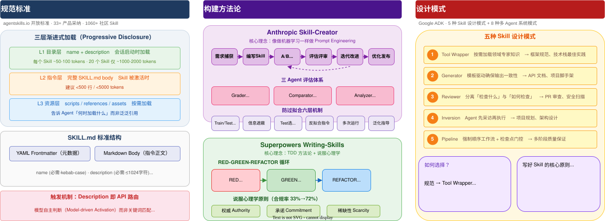

一、Skill 规范标准

**1.1 什么是 Agent Skill**

在 AI Agent 生态中，Skill 是一种可复用的 Prompt 增强包，通过渐进式加载机制为 Agent 注入领域知识和工作流程。2025 年 12 月，Anthropic 将 Skill 规范作为开放标准发布，目前已被 33+ 个 Agent 产品采纳，包括 Claude Code、OpenAI Codex、GitHub Copilot、VS Code、Cursor、Gemini CLI、Kiro 等。

一个 Skill 的最小形态只需要一个文件：

```
skill-name/
```

**1.2 SKILL 格式规范**

根据Anthropic提出的规范，SKILL.md 由 YAML frontmatter（元数据） 和 Markdown body（指令正文） 两部分组成。

YAML frontmatter 字段：

|     |     |     |     |
| --- | --- | --- | --- |
| 字段  | 是否必填 | 说明  | 约束  |
| name | `是` | Skill 的唯一标识名 | 最多 64 个字符，仅允许小写字母、数字和连字符，不能以连字符开头或结尾，不能包含连续连字符，必须与所在文件夹名一致 |
| description | `是` | 描述这个 Skill 做什么、什么时候使用 | 最多 1024 个字符，不能为空，应该包含帮助 AI 识别相关任务的关键词 |
| license | `否` | 许可证信息 | 许可证名称或指向许可证文件的引用 |
| compatibility | `否` | 环境兼容性要求 | 最多 500 字符，说明需要的运行环境或依赖 |
| metadata | `否` | 自定义扩展元数据 | 键值对映射，可存储规范之外的额外属性 |
| allowed-tools | `否` | 预授权工具列表 | 空格分隔的字符串，实验性功能 |

#### 1.2.1 name 字段的命名规则

name 字段有严格的命名规则：

-   必须为 1-64 个字符
    
-   只能包含 Unicode 小写字母数字字符（`a-z`）和连字符（`-`）
    
-   不能以连字符 ( `-`)开头或结尾
    
-   不得包含连续的连字符（`--`）
    
-   必须与父目录名称匹配

合法示例：

```
name: pdf-processing
```

非法示例：

```
name: PDF-Processing    # 不允许大写字母
```

#### 1.2.2 description 字段的写法建议

description 应该清晰描述 Skill 的功能和适用场景：

-   必须为 1-1024 个字符
    
-   应该描述该技能的作用以及何时使用。
    
-   应包含有助于代理识别相关任务的特定关键词。

好的示例：

```
description: Extracts text and tables from PDF files, fills PDF forms, and merges multiple PDFs. Use when working with PDF documents or when the user mentions PDFs, forms, or document extraction.
```

差的示例：

```
description: Helps with PDFs.
```

#### 1.2.3 Markdown 正文内容

元数据之后的 Markdown 正文部分就是 Skill 的核心指令。对正文格式没有硬性限制，只要能帮助 AI 有效执行任务即可。

建议包含以下内容：分步骤的操作说明、输入输出示例、常见边界情况处理。

建议正文控制在 500 行以内。如果内容较多，可以把详细的参考资料拆分到单独的文件中。

#### 1.2.4 最简示例

一个最简的 SKILL.md 只需要 name 和 description：

```
---
```

#### 1.2.5 包含可选字段的示例

```
---
```

#### 1.2.6 文件引用规范

在 SKILL.md 中引用其他文件时，请使用相对于 Skill 根目录的路径。例如：

-   引用参考文档：references/REFERENCE.md
    
-   引用脚本：scripts/extract.py

建议文件引用保持在一层深度，避免深层嵌套的引用链。

#### 1.2.7 可选目录结构

scripts/ 目录

存放 AI 可以运行的可执行代码。脚本应该是自包含的或明确说明依赖关系，包含有用的错误提示信息，并能妥善处理边界情况。常见支持的语言包括 Python、Bash 和 JavaScript。

references/ 目录

存放 AI 在需要时可以读取的补充文档，例如：REFERENCE.md（详细技术参考）、FORMS.md（表单模板或结构化数据格式）、或特定领域的文档（如 finance.md、legal.md）。

建议每个参考文件保持聚焦，因为 AI 是按需加载这些文件的，文件越小，消耗的上下文越少。

assets/ 目录

存放静态资源文件，包括：模板文件（文档模板、配置模板）、图片（示意图、示例图）、数据文件（查找表、Schema 定义）。

**1.3 三层渐进式加载机制**

这是 Agent Skills 规范最精妙的设计，借鉴了 UI/UX 领域的渐进式信息披露策略：

|     |     |     |     |
| --- | --- | --- | --- |
| 层级  | 加载内容 | 加载时机 | Token 成本 |
| L1 目录层 | name + description | 会话启动时 | 每个 Skill ~50-100 tokens |
| L2 指令层 | 完整 SKILL.md body | Skill 被激活时 | 建议 <5000 tokens |
| L3 资源层 | scripts/、references/、assets/ 中的文件 | 指令引用时按需 | 视文件大小 |

关键价值：即使安装了 20 个 Skill，初始加载也仅 1000-2000 tokens。相比单体式提示词，上下文使用量减少约 90%。

L1 层： Agent 启动时只加载所有 Skill 的 name + description，以 XML 格式注入系统提示词。Agent 此时只知道有哪些 Skill 可用。

L2 层： 用户任务匹配某个 Skill 的描述时，Agent 读取完整 SKILL.md body。建议控制在 500 行以内。

L3 层： SKILL.md 中的指令引用外部文件时按需加载。关键是告诉 Agent 何时加载，如「当 API 返回非 200 时，读取 references/api-errors.md」。

**1.4 触发机制设计**

Skill 的触发完全依赖 description 字段，由模型自主判断当前任务是否匹配（Model-driven Activation），而非关键词硬编码匹配。

description 写作要点：

-   使用祈使语气：「Use this skill when...」
    
-   聚焦用户意图，而非 Skill 内部机制
    
-   适当「强势」，覆盖用户可能的各种表述
    
-   包含关键触发词

好的例子：

```
Analyze CSV and tabular data files — compute summary statistics,
```

差的例子：`Helps with PDFs.`

二、Skill-Creator 核心思想

**2.1 设计哲学**

Skill-Creator是 Anthropic 官方的「用来创建 Skill 的 Skill」，其设计哲学可以概括为：像做机器学习一样做 Prompt Engineering —— 有训练集、测试集、评估指标、迭代优化循环、防过拟合机制。

它将软件工程中的 CI/CD、A/B 测试、性能基准等最佳实践，完整移植到 Skill 开发领域。

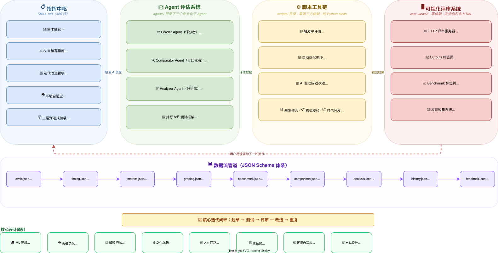

**2.2 核心思想**

1.泛化而非过拟合。 Skill 要被使用无数次、面对无数种 prompt。如果只为测试用例做针对性修改，skill 就废了。遇到顽固问题，尝试换个隐喻或推荐不同的工作模式，而不是加更多死板约束。

2.解释"为什么"而非堆砌"必须"。 这是全文最核心的洞察。今天的 LLM 有良好的心智理论，与其写满大写的 ALWAYS 和 NEVER，不如解释清楚为什么某件事重要。

3.提取重复模式。 如果所有测试用例中 Agent 都独立写了类似的辅助脚本（比如都写了 create\_docx.py），这是一个强信号——应该把这个脚本放到 scripts/ 目录，让 skill 直接调用。

**2.3 完整开发生命周期**

Skill-Creator 定义了六个阶段的闭环流程：

阶段一：需求捕获 → 理解意图、明确触发场景、确定输出格式、区分客观可验证 vs 主观创意型

阶段二：编写 Skill → 编写 SKILL.md（含 YAML frontmatter + 指令主体）+ 准备辅助资源

阶段三：测试执行 → 设计 2-3 个测试用例 → 并行启动 with\_skill 和 without\_skill 两组子 Agent（A/B 测试）→ 利用等待时间起草量化断言 → 捕获 timing 数据

阶段四：评估与评审 → Grader 评分 → 聚合基准数据 → Analyzer 分析模式 → 生成 Eval Viewer → 用户在浏览器中评审 → 收集 feedback.json

阶段五：迭代改进 → 分析反馈 → 泛化改进方向（避免过拟合）→ 重写 Skill → 新 iteration 目录 → 回到阶段三

阶段六：优化与发布 → Description 优化（run\_loop.py）→ 训练/测试集分割 → 自动迭代改进描述 → 校验 → 打包 .skill 文件

**2.4 Agent 系统 — 三个专业化角色**

Skill-Creator 设计了三个独立的子 Agent，各司其职，形成完整的评估链。

#### 2.4.1 Grader Agent（评分者）

职责：评估断言是否通过，并评价评估本身。

8 步流程：读 Transcript → 检查输出文件 → 评估断言 → 提取隐含声明 → 读执行者笔记 → 评价评估本身 → 写结果 → 读指标数据

最精妙的设计是"自我批评"：

> "A passing grade on a weak assertion is worse than useless — it creates false confidence."

> 对一个薄弱断言给出"通过"的评级，其危害比毫无用处还要糟糕——它会制造出虚假的信心。

Grader 不仅评分，还会指出断言本身的问题：

-   一个通过的断言是否太容易满足（如只检查文件名存在，不检查内容）
    
-   是否有重要结果没有被任何断言覆盖
    
-   断言是否无法从可用输出中验证

评分标准：

-   PASS：不仅要有证据，还要证据反映"真正的任务完成"，而非"表面合规"
    
-   FAIL：包括"巧合通过"——断言技术上满足了，但底层任务结果是错的

#### 2.4.2 Comparator Agent（盲比较者）

职责：在不知道哪个输出来自哪个 Skill 的情况下，判断哪个更好。

核心设计——去偏见化：借鉴医学实验中的双盲实验思想，Comparator 只看到 A 和 B，不知道来源。

双维度评分体系：

-   内容维度：正确性、完整性、准确性（各 1-5 分）
    
-   结构维度：组织性、格式化、可用性（各 1-5 分）
    
-   综合为 1-10 的总分

判定优先级：总分 > 断言通过率 > 平局（极少出现）

#### 2.4.3 Analyzer Agent（分析者）

双重角色：

角色 A — 事后分析器：在盲比较后"揭盲"，分析 WHY 赢家赢了：

-   对比两个 Skill 的指令差异和执行模式差异
    
-   生成按优先级排序的改进建议（high / medium / low）
    
-   按类别分类：instructions、tools、examples、error\_handling、structure、references

角色 B — 基准分析器：分析聚合统计数据隐藏的模式：

-   哪些断言在两种配置下都 100% 通过？
    
-   哪些断言高方差？
    
-   时间/token 的异常值

**2.5 数据流与 JSON Schema 体系**

`references/schemas.md` 定义了 7 种 JSON 数据结构，形成完整的数据管道：

```
evals.json          ─── 测试定义（prompt + expectations）
```

**2.6 实践流程：创建一个 Code Review Skill**

以下是一个完整的实践案例，展示如何使用 Skill-Creator 创建一个代码审查 Skill。

#### Step 1：启动 Skill-Creator

在 Claude Code 中直接告诉 Claude 你的需求：

```
我想创建一个 code-review skill，能够对 Git diff 进行结构化的代码审查，
```

Claude 会自动触发 Skill-Creator，开始需求捕获阶段，通过对话帮你明确：

-   触发场景（"review my code"、"check this PR" 等）
    
-   输出格式（Markdown 报告，按严重程度分级）
    
-   是否需要测试用例（代码审查有客观标准，适合量化测试）

#### Step 2：Claude 编写 Skill 草稿

Claude 会基于你的需求编写 `SKILL.md`，包括：

-   YAML frontmatter（name、description）
    
-   审查流程指令
    
-   输出模板
    
-   可能的辅助脚本

#### Step 3：设计测试用例

Claude 会提出 2-3 个测试用例，例如：

```
{
```

你可以修改或添加更多测试用例。

#### Step 4：并行运行测试

Claude 会同时启动 with\_skill 和 without\_skill 两组子 Agent，在等待期间起草量化断言。

#### Step 5：评审结果

Claude 运行 `generate_review.py` 在浏览器中打开 Eval Viewer：

-   Outputs 标签页：逐个查看每个测试用例的输出
    
-   Benchmark 标签页：对比 with\_skill vs without\_skill 的通过率、耗时、token 用量

你在 Viewer 中为每个输出写反馈，完成后点击 "Submit All Reviews"。

|     |     |     |     |     |
| --- | --- | --- | --- | --- |
| PEOMPT | OUTPUT | FORMAL GRADES | Benchmark Results | Eval Set Review |
| 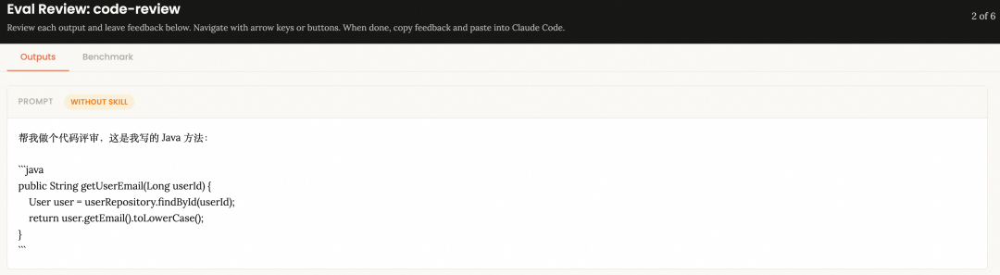 | 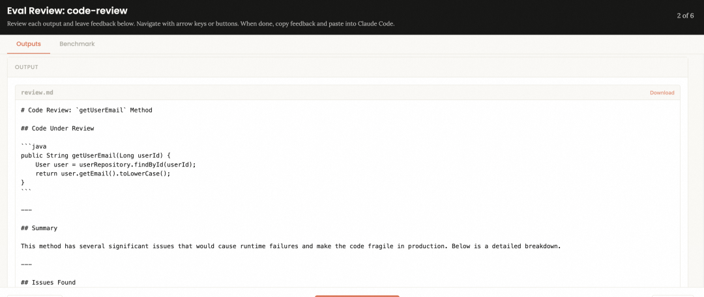 | 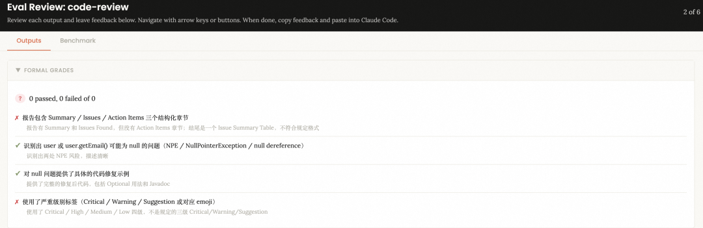 | 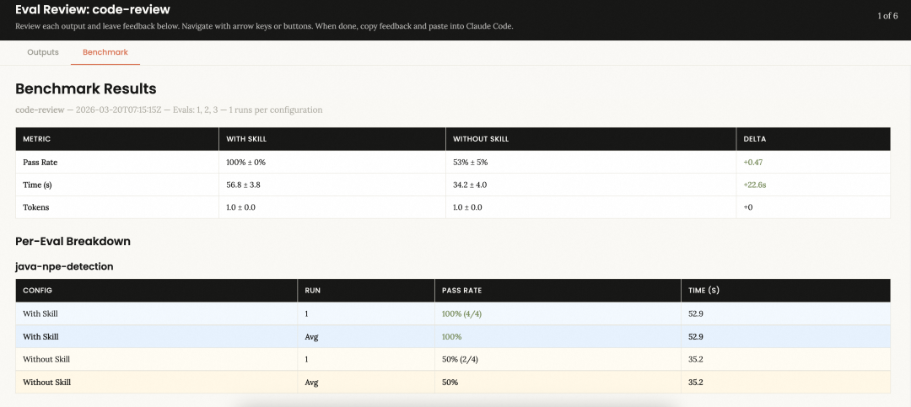<br><br>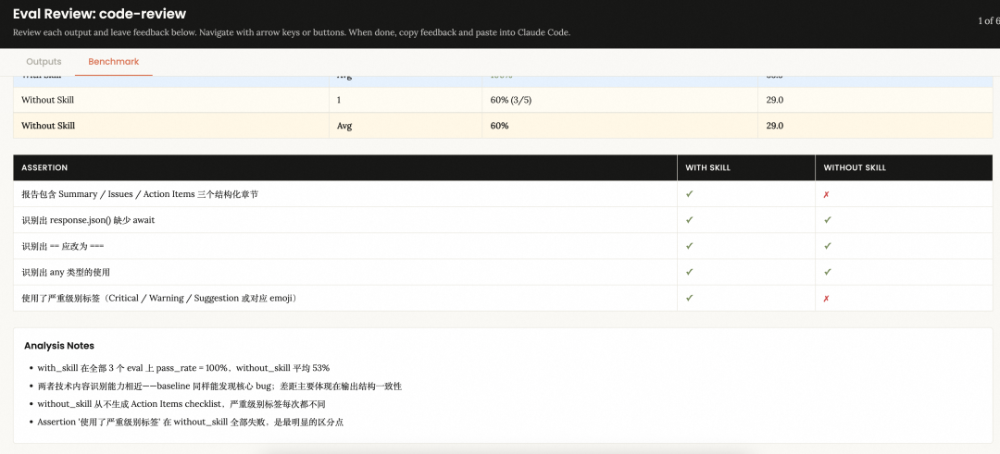 | 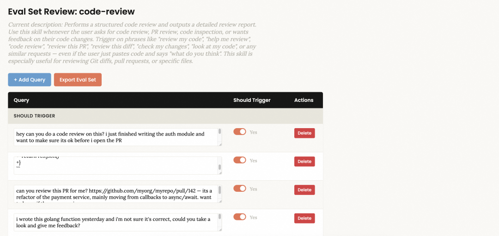<br><br>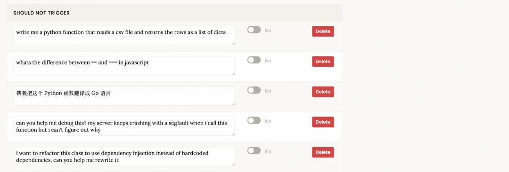 |

```
[
```

#### Step 6：迭代改进

Claude 读取你的 `feedback.json`，分析反馈，改进 Skill，然后重新运行测试。这个循环持续到你满意为止。

```
{
```

#### Step 7：优化 Description

Skill 内容确定后，运行 description 优化：

```
python -m scripts.run_loop \
```

这会自动进行训练/测试集分割，迭代优化 description 的触发准确率。

#### Step 8：打包发布

```
python -m scripts.package_skill path/to/code-review
```

生成 `code-review.skill` 文件，可以分享给其他人安装使用。

**2.7 优势与局限**

> 本节结合个人实践体验与社区真实反馈，对 Skill-Creator 进行客观评价。

#### 2.7.1. 优势

|     |     |
| --- | --- |
| 优势  | 说明  |
| 方法论完整 | 将 ML 工程实践（训练/测试集分割、防过拟合）引入 Prompt Engineering，是目前最系统化的 Skill 开发框架 |
| 评估体系严谨 | 三 Agent 协作（Grader + Comparator + Analyzer）+ 量化基准，远超"凭感觉改 Prompt"的传统方式 |
| 零依赖可移植 | 纯 Python stdlib + `claude` CLI，无需安装任何第三方包，任何环境均可运行 |
| 人机协作设计 | Eval Viewer 让人类判断质量，自动化处理重复工作，分工合理 |
| 自举式架构 | 用 Skill 框架管理 Skill 生命周期，设计优雅，具有示范意义 |

#### 2.7.2. 已知局限与社区反馈

##### 问题一：Token 消耗极高，成本不透明

这是社区反映最集中的问题，有真实数据为证。

GitHub Issue #514（2026-03-04，来自 `anthropics/claude-plugins-official`）：

> "A single description optimization run with 20 eval queries (3 runs each = 60 sessions) consumed ~69% of a 5-hour time block, with 0 actionable results."— jroy-poka, GitHub Issue #514

问题根源：`SKILL.md` 第 385 行指示 `run_loop.py` 使用 `--model <session-model>`，即当前会话所用的模型。当用户使用 Opus 会话时，description 优化会启动 60+ 个 Opus 级别的 `claude -p` 子进程，而触发检测本质上只是一个"是/否"的二元信号，完全不需要 Opus 级别的推理能力。

量化影响：

-   20 个评估查询 × 3 次运行 = 60 个并发 Opus 会话
    
-   单次优化循环消耗约 69% 的 5 小时配额
    
-   用户在触发前对成本完全没有预期

社区建议的修复方案是将 eval 默认模型改为 `claude-haiku`（成本降低 10-20 倍，触发检测精度等价），但截至当前该问题仍处于 Open 状态。

##### 问题二：流程冗长，用户需多次确认

Skill-Creator 的完整流程涉及大量交互节点：

```
需求确认 → Skill 草稿确认 → 测试用例确认 → 并行运行（等待）
```

每一轮迭代都需要用户：

1.在浏览器中逐个查看测试用例输出

2.为每个输出撰写文字反馈

3.提交 `feedback.json`

4.回到对话告知 Claude 已完成

对于简单的 Skill（如一个格式转换工具），这套流程的开销远超 Skill 本身的价值。社区中有用户直接表示："对于简单需求，直接手写 SKILL.md 比用 skill-creator 快得多。"

##### 问题三：子任务数量庞大，并发管理复杂

一次完整的评测包含：

-   N 个测试用例 × 2（with\_skill + without\_skill） 个执行子 Agent
    
-   N 个 Grader 子 Agent（评分）
    
-   1 个 Analyzer 子 Agent（分析）
    
-   可选：N 个 Comparator 子 Agent（盲比较）

以 3 个测试用例为例，单轮评测就会产生 6 个执行 + 3 个评分 + 1 个分析 = 10 个子 Agent。多轮迭代下子任务数量呈线性增长，在 Claude Code 的子 Agent 并发限制下容易出现排队等待。

##### 问题四：Description 优化对"操作型 Skill"效果有限

GitHub Issue #514 中还指出了一个深层问题：

> "operational workflow skills show 0% recall regardless of description quality"

对于某些"操作型"Skill（如"运行部署脚本"、"生成日报"），Claude 本身就能直接处理，不会主动去查询 Skill，导致触发率始终为 0%，description 优化完全无效。这类 Skill 的触发机制与 description 质量无关，而是取决于任务的复杂度和专业性。

##### 问题五：Skill 膨胀风险

来自 Medium 社区的观察（Claude Code Skills Deep Dive）：

> "A 5KB skill balloons to 50KB. Response times slow to a crawl. Maintenance becomes a nightmare. Your once-elegant skill has become a bloated monster."

随着迭代改进，Skill 有膨胀倾向——每次改进都可能增加新的指令、示例、边界情况处理，最终导致 Skill 体积失控，违背"保持精简"的初衷。

##### 问题六：学习曲线陡峭

Skill-Creator 的完整使用需要理解：

-   Skill 的三层加载机制
    
-   JSON Schema 体系（7 种数据结构）
    
-   子 Agent 的工作原理
    
-   触发率评估的统计含义
    
-   训练/测试集分割的防过拟合逻辑

对于非技术背景的用户，这套体系的认知负担相当高。

三、Writing-Skills 核心思想

**3.1 Superpowers 框架概述**

Superpowers 是一个专门为 Claude Code、Cursor、Codex 等 AI 编程助手设计的结构化工作流框架，定位是「Vibe Engineering」——在 AI 快速迭代的基础上强制注入软件工程纪律。

框架包含 14 个可组合的 Skill，覆盖从头脑风暴到代码交付的完整开发流程。核心理念：

-   测试先行（Test-Driven Development）
    
-   系统化优于随机化（Process over Guessing）
    
-   复杂度缩减（Simplicity as Primary Goal）
    
-   证据优于声明（Verify before Declaring Success）

**3.2 Writing-Skills 的核心定位**

Writing-Skills 是 Superpowers 中的元技能——教 Agent 如何创建新的 Skill。它与 Anthropic 的 skill-creator 目标相似，但方法论截然不同。

文件结构：

```
writing-skills/
```

|     |     |
| --- | --- |
| TDD 概念 | Skill 创建 |
| 测试用例 | 压力场景 + 子代理 |
| 生产代码 | Skill 文档（SKILL.md） |
| 测试失败（RED） | Agent 在没有 Skill 时违反规则（基线） |
| 测试通过（GREEN） | Agent 在有 Skill 时遵守规则 |
| 重构（REFACTOR） | 堵住漏洞，同时保持合规 |

**3.3 RED-GREEN-REFACTOR 循环**

#### RED 阶段：基线测试

不带 Skill 运行压力场景，记录 Agent 的确切行为和合理化借口：

```
场景示例：
```

不带 TDD Skill 运行，Agent 选择 B 或 C 并合理化：

-   "我已经手动测试过了"
    
-   "先写后测也能达到同样目的"
    
-   "删除是浪费"

现在你知道 Skill 必须防止什么了。

#### GREEN 阶段：编写最小 Skill

针对基线中发现的具体失败编写 Skill，不要为假设的情况添加额外内容。

#### REFACTOR 阶段：堵住漏洞

Agent 找到新的合理化借口？逐一添加明确的反驳：

|     |     |
| --- | --- |
| 借口  | 现实  |
| "保留作为参考，先写测试" | 你会改编它。那就是事后测试。删除就是删除。 |
| "我遵循的是精神而非字面" | 违反字面就是违反精神。 |
| "太简单不需要测试" | 简单的代码也会出错。测试只需 30 秒。 |

**3.4 四种 Skill 类型及对应测试策略**

不同类型的 Skill 需要不同的测试方法：

|     |     |     |     |
| --- | --- | --- | --- |
| Skill 类型 | 定义  | 测试方法 | 成功标准 |
| 纪律执行型 | 强制遵守规则（如 TDD、验证要求） | 压力场景：时间+沉没成本+疲劳组合施压 | Agent 在最大压力下仍遵守规则 |
| 技术指导型 | 具体方法的操作指南（如条件等待、根因追踪） | 应用场景：能否正确应用？边界情况？指令有无缺口？ | Agent 成功将技术应用到新场景 |
| 思维模式型 | 解决问题的心智模型（如降低复杂度、信息隐藏） | 识别场景：能否识别何时适用？何时不适用？ | Agent 正确判断何时/如何应用模式 |
| 参考资料型 | API 文档、命令参考、库指南 | 检索场景：能否找到正确信息？常见用例是否覆盖？ | Agent 找到并正确应用参考信息 |

关键区别：纪律执行型 Skill 需要最严格的测试（压力场景 + 合理化借口反驳），而参考资料型 Skill 主要测试信息的可发现性和完整性。

**3.5 Description 的关键要点**

> 这是 writing-skills 中最重要的发现之一。

Description 只应描述触发条件，绝不要总结 Skill 的工作流程。

为什么？ 测试发现，当 description 总结了工作流程时，Agent 可能直接按 description 执行，而跳过阅读完整的 Skill 内容。

```
# ❌ 总结了工作流 → Agent 可能走捷径，跳过 Skill 正文
```

**3.6 Anthropic 官方最佳实践要点**

> 来源：writing-skills 中引用的 anthropic-best-practices.md

#### 简洁是关键

Context window 是公共资源。默认假设 Claude 已经很聪明，只添加它不知道的信息：

```
# ✅ 简洁（~50 tokens）
```

#### 设置合适的自由度

|     |     |     |
| --- | --- | --- |
| 自由度 | 适用场景 | 示例  |
| 高   | 多种方法都有效 | 代码审查流程 |
| 中   | 有首选模式但允许变化 | 带参数的脚本模板 |
| 低   | 操作脆弱、一致性关键 | 数据库迁移命令 |

#### 工作流与反馈循环

对于复杂任务，Skill 中应包含清晰的工作流步骤和反馈循环：

工作流模式：将复杂操作拆分为清晰的顺序步骤，提供可追踪的检查清单：

```
## 研究综合工作流
```

反馈循环模式：运行验证器 → 修复错误 → 重复，直到通过。这个模式能显著提升输出质量：

```
## 文档编辑流程
```

关键：验证脚本的错误信息要具体（如 "Field 'signature\_date' not found. Available fields: customer\_name, order\_total"），帮助 Agent 快速定位和修复问题。

#### 迭代开发模式

最有效的 Skill 开发过程：

```
Claude A（专家）帮你设计和优化 Skill
```

四、Skill 设计模式（Google）

> 来源：Google Cloud Tech

规范告诉我们"Skill 长什么样"，但没告诉我们"Skill 内部的逻辑该怎么设计"。一个封装 FastAPI 规范的 Skill 和一个分 4 步执行的文档流水线 Skill，虽然外表都叫 SKILL.md，但内部结构完全不是一回事。

Google ADK 团队研究了生态中各种 Skill 的实现方式，从 Anthropic 仓库到 Vercel 和 Google 内部指南，总结出 5 种反复出现的设计模式。

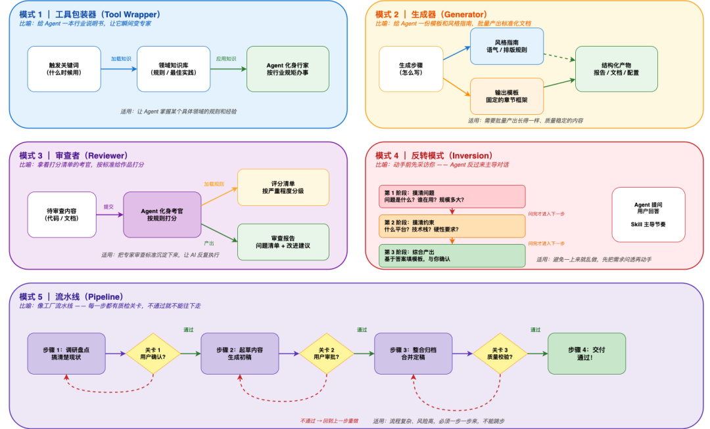

**4.1 五种 Skill 设计模式**

#### 模式一：Tool Wrapper — 给 Agent 装"技能包"

核心逻辑：让 Agent 在需要时才加载特定领域的知识，而不是把所有东西塞进 system prompt。

```
---
```

关键：SKILL.md 本身不包含完整规范，而是告诉 Agent 去哪里加载规范。

适用场景：封装框架/库的编码规范、团队内部代码风格指南、特定技术栈的最佳实践。

#### 模式二：Generator — 填空题式文档生成

核心逻辑：用模板 + 风格指南强制输出一致性。

```
---
```

关键：Step 3 的主动提问——Agent 不会瞎猜，缺什么直接问。

适用场景：标准化技术文档生成、API 文档自动生成、项目脚手架。

#### 模式三：Reviewer — 代码审查自动化

核心逻辑：把"查什么"和"怎么查"分离。检查清单独立维护，Agent 只负责执行打分。

```
---
```

关键：Step 3 的 "WHY not WHAT"——不只指出问题，还要解释为什么是问题。

适用场景：自动化 PR 审查、安全漏洞扫描、代码风格检查。

#### 模式四：Inversion — 让 Agent 先问你

核心逻辑：翻转传统交互模式。不是用户驱动 prompt → Agent 执行，而是 Agent 先采访用户，收集完整需求后再动手。

```
---
```

适用场景：新项目规划、系统架构设计、需求不明确时的需求澄清。

#### 模式五：Pipeline — 带检查点的多步工作流

核心逻辑：把复杂任务拆成严格顺序的步骤，每步都有明确的输入/输出和通过条件，Agent 不能跳步。

```
---
```

关键：Step 2 → Step 3 的 【确认前不得继续】 是硬性约束——用户不点头，Agent 不能往下走。

适用场景：从代码生成文档、多阶段内容生产、需要人工检查点的自动化流程。

**4.2 设计模式选择指南**

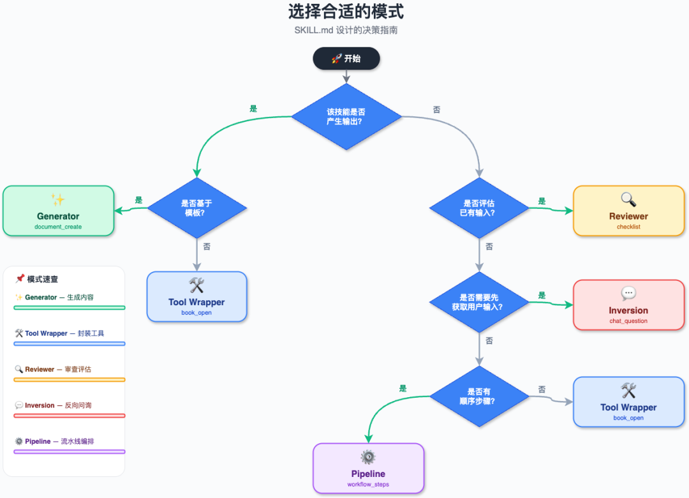

|     |     |
| --- | --- |
| 你需要什么？ | 选择哪种模式 |
| 特定技术栈的专家知识 | Tool Wrapper |
| 一致的结构化输出 | Generator |
| 自动化代码/内容审查 | Reviewer |
| 需求不明确，需先收集信息 | Inversion |
| 复杂的多步骤任务 | Pipeline |
| 不确定？ | 从 Tool Wrapper 开始 |

**4.3 模式组合推荐**

|     |     |     |
| --- | --- | --- |
| 组合  | 说明  | 场景  |
| Pipeline + Reviewer | 管道最后一步加自动审查 | 文档生成后自动质量检查 |
| Generator + Inversion | 先收集信息再填充模板 | 需用户输入的结构化文档生成 |
| Pipeline + Tool Wrapper | 管道某些步骤加载专家知识 | 多步骤代码生成 |
| Inversion + Pipeline | 先完成需求收集再进入执行流水线 | 复杂项目全流程 |

五、总结

Skill 生态正在快速发展，已形成 规范标准（agentskills.io）→ 构建方法论（Anthropic/Superpowers）→ 设计模式（Google） 的完整知识体系。三个关键认知：

1.Skill 不是 Prompt，而是围绕任务、工具、流程和输出边界的结构化行为设计

2.渐进式加载是核心机制，解决了 Agent 系统的上下文膨胀问题

3.描述是触发的关键，写好 description 比写好指令主体更重要

参考资料

<div class="joplin-table-wrapper"><table><tbody><tr><td><p style="line-height: 1.75em;margin-bottom: 24px;"><span data-cangjie-key="2014:0" data-cangjie-leaf="true" data-cangjie-mark="true" data-testid="2014:0"><span leaf="" style="color: rgba(0, 0, 0, 0.9);font-size: 17px;font-family: mp-quote, &quot;PingFang SC&quot;, system-ui, -apple-system, BlinkMacSystemFont, &quot;Helvetica Neue&quot;, &quot;Hiragino Sans GB&quot;, &quot;Microsoft YaHei UI&quot;, &quot;Microsoft YaHei&quot;, Arial, sans-serif;letter-spacing: 0.034em;font-style: normal;font-weight: normal;"><span textstyle="" style="font-size: 15px;color: rgb(62, 62, 62);">描述</span></span></span></p></td><td><p style="line-height: 1.75em;margin-bottom: 24px;"><span data-cangjie-key="2019:0" data-cangjie-leaf="true" data-cangjie-mark="true" data-testid="2019:0"><span leaf="" style="color: rgba(0, 0, 0, 0.9);font-size: 17px;font-family: mp-quote, &quot;PingFang SC&quot;, system-ui, -apple-system, BlinkMacSystemFont, &quot;Helvetica Neue&quot;, &quot;Hiragino Sans GB&quot;, &quot;Microsoft YaHei UI&quot;, &quot;Microsoft YaHei&quot;, Arial, sans-serif;letter-spacing: 0.034em;font-style: normal;font-weight: normal;"><span textstyle="" style="font-size: 15px;color: rgb(62, 62, 62);">链接</span></span></span></p></td></tr><tr><td><p style="line-height: 1.75em;margin-bottom: 24px;"><span data-cangjie-key="2026:0" data-cangjie-leaf="true" data-cangjie-mark="true" data-testid="2026:0"><span leaf="" style="color: rgba(0, 0, 0, 0.9);font-size: 17px;font-family: mp-quote, &quot;PingFang SC&quot;, system-ui, -apple-system, BlinkMacSystemFont, &quot;Helvetica Neue&quot;, &quot;Hiragino Sans GB&quot;, &quot;Microsoft YaHei UI&quot;, &quot;Microsoft YaHei&quot;, Arial, sans-serif;letter-spacing: 0.034em;font-style: normal;font-weight: normal;"><span textstyle="" style="font-size: 15px;color: rgb(62, 62, 62);">Agent Skills 开放规范</span></span></span></p></td><td><p style="line-height: 1.75em;margin-bottom: 24px;"><span data-testid="list-symbol"><span leaf="" style="color: rgba(0, 0, 0, 0.9);font-size: 17px;font-family: mp-quote, &quot;PingFang SC&quot;, system-ui, -apple-system, BlinkMacSystemFont, &quot;Helvetica Neue&quot;, &quot;Hiragino Sans GB&quot;, &quot;Microsoft YaHei UI&quot;, &quot;Microsoft YaHei&quot;, Arial, sans-serif;letter-spacing: 0.034em;font-style: normal;font-weight: normal;"><span textstyle="" style="font-size: 15px;color: rgb(62, 62, 62);">https://agentskills.io/specification</span></span></span><span data-cangjie-key="2038:0" data-cangjie-leaf="true" data-cangjie-mark="true" data-testid="2038:0" style="box-sizing: inherit;max-width: 100%;font-family: &quot;DingTalk JinBuTi&quot;, 钉钉进步体, DingTalk-JinBuTi;"></span></p></td></tr><tr><td><p style="line-height: 1.75em;margin-bottom: 24px;"><span data-cangjie-key="2045:0" data-cangjie-leaf="true" data-cangjie-mark="true" data-testid="2045:0"><span leaf="" style="color: rgba(0, 0, 0, 0.9);font-size: 17px;font-family: mp-quote, &quot;PingFang SC&quot;, system-ui, -apple-system, BlinkMacSystemFont, &quot;Helvetica Neue&quot;, &quot;Hiragino Sans GB&quot;, &quot;Microsoft YaHei UI&quot;, &quot;Microsoft YaHei&quot;, Arial, sans-serif;letter-spacing: 0.034em;font-style: normal;font-weight: normal;"><span textstyle="" style="font-size: 15px;color: rgb(62, 62, 62);">Anthropic 官方 Skills 仓库</span></span></span></p></td><td><p style="line-height: 1.75em;margin-bottom: 24px;"><span data-cangjie-key="2050:0" data-cangjie-leaf="true" data-cangjie-mark="true" data-testid="2050:0"><span leaf="" style="color: rgba(0, 0, 0, 0.9);font-size: 17px;font-family: mp-quote, &quot;PingFang SC&quot;, system-ui, -apple-system, BlinkMacSystemFont, &quot;Helvetica Neue&quot;, &quot;Hiragino Sans GB&quot;, &quot;Microsoft YaHei UI&quot;, &quot;Microsoft YaHei&quot;, Arial, sans-serif;letter-spacing: 0.034em;font-style: normal;font-weight: normal;"><span textstyle="" style="font-size: 15px;color: rgb(62, 62, 62);">https://github.com/anthropics/skills</span></span></span></p></td></tr><tr><td><p style="line-height: 1.75em;margin-bottom: 24px;"><span data-cangjie-key="2057:0" data-cangjie-leaf="true" data-cangjie-mark="true" data-testid="2057:0"><span leaf="" style="color: rgba(0, 0, 0, 0.9);font-size: 17px;font-family: mp-quote, &quot;PingFang SC&quot;, system-ui, -apple-system, BlinkMacSystemFont, &quot;Helvetica Neue&quot;, &quot;Hiragino Sans GB&quot;, &quot;Microsoft YaHei UI&quot;, &quot;Microsoft YaHei&quot;, Arial, sans-serif;letter-spacing: 0.034em;font-style: normal;font-weight: normal;"><span textstyle="" style="font-size: 15px;color: rgb(62, 62, 62);">Superpowers 框架</span></span></span></p></td><td><p style="line-height: 1.75em;margin-bottom: 24px;"><span data-cangjie-key="2062:0" data-cangjie-leaf="true" data-cangjie-mark="true" data-testid="2062:0"><span leaf="" style="color: rgba(0, 0, 0, 0.9);font-size: 17px;font-family: mp-quote, &quot;PingFang SC&quot;, system-ui, -apple-system, BlinkMacSystemFont, &quot;Helvetica Neue&quot;, &quot;Hiragino Sans GB&quot;, &quot;Microsoft YaHei UI&quot;, &quot;Microsoft YaHei&quot;, Arial, sans-serif;letter-spacing: 0.034em;font-style: normal;font-weight: normal;"><span textstyle="" style="font-size: 15px;color: rgb(62, 62, 62);">https://github.com/obra/superpowers</span></span></span></p></td></tr><tr><td><p style="line-height: 1.75em;margin-bottom: 24px;"><span data-cangjie-key="2069:0" data-cangjie-leaf="true" data-cangjie-mark="true" data-testid="2069:0"><span leaf="" style="color: rgba(0, 0, 0, 0.9);font-size: 17px;font-family: mp-quote, &quot;PingFang SC&quot;, system-ui, -apple-system, BlinkMacSystemFont, &quot;Helvetica Neue&quot;, &quot;Hiragino Sans GB&quot;, &quot;Microsoft YaHei UI&quot;, &quot;Microsoft YaHei&quot;, Arial, sans-serif;letter-spacing: 0.034em;font-style: normal;font-weight: normal;"><span textstyle="" style="font-size: 15px;color: rgb(62, 62, 62);">Google ADK Skill 设计模式</span></span></span></p></td><td><p style="line-height: 1.75em;margin-bottom: 24px;"><span data-testid="list-symbol"><span leaf="" style="color: rgba(0, 0, 0, 0.9);font-size: 17px;font-family: mp-quote, &quot;PingFang SC&quot;, system-ui, -apple-system, BlinkMacSystemFont, &quot;Helvetica Neue&quot;, &quot;Hiragino Sans GB&quot;, &quot;Microsoft YaHei UI&quot;, &quot;Microsoft YaHei&quot;, Arial, sans-serif;letter-spacing: 0.034em;font-style: normal;font-weight: normal;"><span textstyle="" style="font-size: 15px;color: rgb(62, 62, 62);">https://x.com/GoogleCloudTech/status/2033953579824758855</span></span></span><span data-cangjie-key="2085:0" data-cangjie-leaf="true" data-cangjie-mark="true" data-testid="2085:0" style="box-sizing: inherit;max-width: 100%;font-family: &quot;DingTalk JinBuTi&quot;, 钉钉进步体, DingTalk-JinBuTi;"></span></p></td></tr><tr><td><p style="line-height: 1.75em;margin-bottom: 24px;"><span data-cangjie-key="2092:0" data-cangjie-leaf="true" data-cangjie-mark="true" data-testid="2092:0"><span leaf="" style="color: rgba(0, 0, 0, 0.9);font-size: 17px;font-family: mp-quote, &quot;PingFang SC&quot;, system-ui, -apple-system, BlinkMacSystemFont, &quot;Helvetica Neue&quot;, &quot;Hiragino Sans GB&quot;, &quot;Microsoft YaHei UI&quot;, &quot;Microsoft YaHei&quot;, Arial, sans-serif;letter-spacing: 0.034em;font-style: normal;font-weight: normal;"><span textstyle="" style="font-size: 15px;color: rgb(62, 62, 62);">Awesome Agent Skills（1060+ Skills）</span></span></span></p></td><td><p style="line-height: 1.75em;margin-bottom: 24px;"><span data-cangjie-key="2097:0" data-cangjie-leaf="true" data-cangjie-mark="true" data-testid="2097:0"><span leaf="" style="color: rgba(0, 0, 0, 0.9);font-size: 17px;font-family: mp-quote, &quot;PingFang SC&quot;, system-ui, -apple-system, BlinkMacSystemFont, &quot;Helvetica Neue&quot;, &quot;Hiragino Sans GB&quot;, &quot;Microsoft YaHei UI&quot;, &quot;Microsoft YaHei&quot;, Arial, sans-serif;letter-spacing: 0.034em;font-style: normal;font-weight: normal;"><span textstyle="" style="font-size: 15px;color: rgb(62, 62, 62);">https://github.com/VoltAgent/awesome-agent-skills</span></span></span></p></td></tr><tr><td><p style="line-height: 1.75em;margin-bottom: 24px;"><span data-cangjie-key="2104:0" data-cangjie-leaf="true" data-cangjie-mark="true" data-testid="2104:0"><span leaf="" style="color: rgba(0, 0, 0, 0.9);font-size: 17px;font-family: mp-quote, &quot;PingFang SC&quot;, system-ui, -apple-system, BlinkMacSystemFont, &quot;Helvetica Neue&quot;, &quot;Hiragino Sans GB&quot;, &quot;Microsoft YaHei UI&quot;, &quot;Microsoft YaHei&quot;, Arial, sans-serif;letter-spacing: 0.034em;font-style: normal;font-weight: normal;"><span textstyle="" style="font-size: 15px;color: rgb(62, 62, 62);">Anthropic 黑客马拉松获胜者的完整 Claude Code 配置集合（包含skills）</span></span></span></p></td><td><p style="line-height: 1.75em;margin-bottom: 24px;"><span data-cangjie-key="2109:0" data-cangjie-leaf="true" data-cangjie-mark="true" data-testid="2109:0" style="box-sizing: inherit;max-width: 100%;font-family: &quot;DingTalk JinBuTi&quot;, 钉钉进步体, DingTalk-JinBuTi;"></span><span data-cangjie-key="2112:0" data-cangjie-leaf="true" data-cangjie-mark="true" data-testid="2112:0"><span leaf="" style="color: rgba(0, 0, 0, 0.9);font-size: 17px;font-family: mp-quote, &quot;PingFang SC&quot;, system-ui, -apple-system, BlinkMacSystemFont, &quot;Helvetica Neue&quot;, &quot;Hiragino Sans GB&quot;, &quot;Microsoft YaHei UI&quot;, &quot;Microsoft YaHei&quot;, Arial, sans-serif;letter-spacing: 0.034em;font-style: normal;font-weight: normal;"><span textstyle="" style="font-size: 15px;color: rgb(62, 62, 62);">https://github.com/affaan-m/everything-claude-code</span></span></span><span data-cangjie-key="2113:0" data-cangjie-leaf="true" data-cangjie-mark="true" data-testid="2113:0" style="box-sizing: inherit;max-width: 100%;font-family: &quot;DingTalk JinBuTi&quot;, 钉钉进步体, DingTalk-JinBuTi;"></span></p></td></tr><tr><td><p style="line-height: 1.75em;margin-bottom: 24px;"><span data-cangjie-key="2120:0" data-cangjie-leaf="true" data-cangjie-mark="true" data-testid="2120:0"><span leaf="" style="color: rgba(0, 0, 0, 0.9);font-size: 17px;font-family: mp-quote, &quot;PingFang SC&quot;, system-ui, -apple-system, BlinkMacSystemFont, &quot;Helvetica Neue&quot;, &quot;Hiragino Sans GB&quot;, &quot;Microsoft YaHei UI&quot;, &quot;Microsoft YaHei&quot;, Arial, sans-serif;letter-spacing: 0.034em;font-style: normal;font-weight: normal;"><span textstyle="" style="font-size: 15px;color: rgb(62, 62, 62);">开源skills市场</span></span></span></p></td><td><ul style="list-style-type: disc;" class="list-paddingleft-1"><li><p style="line-height: 1.75em;margin-bottom: 24px;"><span data-testid="list-symbol"><span leaf="" style="color: rgba(0, 0, 0, 0.9);font-size: 17px;font-family: mp-quote, &quot;PingFang SC&quot;, system-ui, -apple-system, BlinkMacSystemFont, &quot;Helvetica Neue&quot;, &quot;Hiragino Sans GB&quot;, &quot;Microsoft YaHei UI&quot;, &quot;Microsoft YaHei&quot;, Arial, sans-serif;letter-spacing: 0.034em;font-style: normal;font-weight: normal;"><span textstyle="" style="font-size: 15px;color: rgb(62, 62, 62);">https://skills.sh</span></span></span><span data-cangjie-key="2129:0" data-cangjie-leaf="true" data-cangjie-mark="true" data-testid="2129:0" style="box-sizing: inherit;max-width: 100%;font-family: &quot;DingTalk JinBuTi&quot;, 钉钉进步体, DingTalk-JinBuTi;"></span></p></li></ul><ul style="list-style-type: disc;" class="list-paddingleft-1"><li><p style="line-height: 1.75em;margin-bottom: 24px;"><span data-testid="list-symbol"><span leaf="" style="color: rgba(0, 0, 0, 0.9);font-size: 17px;font-family: mp-quote, &quot;PingFang SC&quot;, system-ui, -apple-system, BlinkMacSystemFont, &quot;Helvetica Neue&quot;, &quot;Hiragino Sans GB&quot;, &quot;Microsoft YaHei UI&quot;, &quot;Microsoft YaHei&quot;, Arial, sans-serif;letter-spacing: 0.034em;font-style: normal;font-weight: normal;"><span textstyle="" style="font-size: 15px;color: rgb(62, 62, 62);">https://skillsmp.com</span></span></span><span data-cangjie-key="2136:0" data-cangjie-leaf="true" data-cangjie-mark="true" data-testid="2136:0" style="box-sizing: inherit;max-width: 100%;font-family: &quot;DingTalk JinBuTi&quot;, 钉钉进步体, DingTalk-JinBuTi;"></span></p></li></ul><ul style="list-style-type: disc;" class="list-paddingleft-1"><li><p style="line-height: 1.75em;margin-bottom: 24px;"><span data-testid="list-symbol"><span leaf="" style="color: rgba(0, 0, 0, 0.9);font-size: 17px;font-family: mp-quote, &quot;PingFang SC&quot;, system-ui, -apple-system, BlinkMacSystemFont, &quot;Helvetica Neue&quot;, &quot;Hiragino Sans GB&quot;, &quot;Microsoft YaHei UI&quot;, &quot;Microsoft YaHei&quot;, Arial, sans-serif;letter-spacing: 0.034em;font-style: normal;font-weight: normal;"><span textstyle="" style="font-size: 15px;color: rgb(62, 62, 62);">https://github.com/openclaw/clawhub</span></span></span><span data-cangjie-key="2143:0" data-cangjie-leaf="true" data-cangjie-mark="true" data-testid="2143:0" style="box-sizing: inherit;max-width: 100%;font-family: &quot;DingTalk JinBuTi&quot;, 钉钉进步体, DingTalk-JinBuTi;"></span></p></li></ul><ul style="list-style-type: disc;" class="list-paddingleft-1"><li><p style="line-height: 1.75em;margin-bottom: 24px;"><span data-testid="list-symbol"><span leaf="" style="color: rgba(0, 0, 0, 0.9);font-size: 17px;font-family: mp-quote, &quot;PingFang SC&quot;, system-ui, -apple-system, BlinkMacSystemFont, &quot;Helvetica Neue&quot;, &quot;Hiragino Sans GB&quot;, &quot;Microsoft YaHei UI&quot;, &quot;Microsoft YaHei&quot;, Arial, sans-serif;letter-spacing: 0.034em;font-style: normal;font-weight: normal;"><span textstyle="" style="font-size: 15px;color: rgb(62, 62, 62);">https://qoder-community.pages.dev/zh/skills</span></span></span><span data-cangjie-key="2150:0" data-cangjie-leaf="true" data-cangjie-mark="true" data-testid="2150:0" style="box-sizing: inherit;max-width: 100%;font-family: &quot;DingTalk JinBuTi&quot;, 钉钉进步体, DingTalk-JinBuTi;"></span></p></li></ul><ul style="list-style-type: disc;" class="list-paddingleft-1"><li><p style="line-height: 1.75em;margin-bottom: 24px;"><span data-testid="list-symbol"><span leaf="" style="color: rgba(0, 0, 0, 0.9);font-size: 17px;font-family: mp-quote, &quot;PingFang SC&quot;, system-ui, -apple-system, BlinkMacSystemFont, &quot;Helvetica Neue&quot;, &quot;Hiragino Sans GB&quot;, &quot;Microsoft YaHei UI&quot;, &quot;Microsoft YaHei&quot;, Arial, sans-serif;letter-spacing: 0.034em;font-style: normal;font-weight: normal;"><span textstyle="" style="font-size: 15px;color: rgb(62, 62, 62);">https://github.com/cinience/alicloud-skills</span></span></span><span data-cangjie-key="2157:0" data-cangjie-leaf="true" data-cangjie-mark="true" data-testid="2157:0" style="box-sizing: inherit;max-width: 100%;font-family: &quot;DingTalk JinBuTi&quot;, 钉钉进步体, DingTalk-JinBuTi;"></span></p></li></ul><ul style="list-style-type: disc;" class="list-paddingleft-1"><li><p style="line-height: 1.75em;margin-bottom: 24px;"><span data-testid="list-symbol"><span leaf="" style="color: rgba(0, 0, 0, 0.9);font-size: 17px;font-family: mp-quote, &quot;PingFang SC&quot;, system-ui, -apple-system, BlinkMacSystemFont, &quot;Helvetica Neue&quot;, &quot;Hiragino Sans GB&quot;, &quot;Microsoft YaHei UI&quot;, &quot;Microsoft YaHei&quot;, Arial, sans-serif;letter-spacing: 0.034em;font-style: normal;font-weight: normal;"><span textstyle="" style="font-size: 15px;color: rgb(62, 62, 62);">https://hermes-agent.nousresearch.com/docs/skills</span></span></span></p></li></ul><p style="line-height: 1.75em;margin-bottom: 24px;"><span data-cangjie-key="2171:0" data-cangjie-leaf="true" data-cangjie-mark="true" data-testid="2171:0" style="box-sizing: inherit;max-width: 100%;font-family: &quot;DingTalk JinBuTi&quot;, 钉钉进步体, DingTalk-JinBuTi;"></span></p></td></tr><tr><td><p style="line-height: 1.75em;margin-bottom: 24px;"><span data-cangjie-key="2178:0" data-cangjie-leaf="true" data-cangjie-mark="true" data-testid="2178:0"><span leaf="" style="color: rgba(0, 0, 0, 0.9);font-size: 17px;font-family: mp-quote, &quot;PingFang SC&quot;, system-ui, -apple-system, BlinkMacSystemFont, &quot;Helvetica Neue&quot;, &quot;Hiragino Sans GB&quot;, &quot;Microsoft YaHei UI&quot;, &quot;Microsoft YaHei&quot;, Arial, sans-serif;letter-spacing: 0.034em;font-style: normal;font-weight: normal;"><span textstyle="" style="font-size: 15px;color: rgb(62, 62, 62);">skill评测</span></span></span></p></td><td><ul style="list-style-type: disc;" class="list-paddingleft-1"><li><p style="line-height: 1.75em;margin-bottom: 24px;"><span data-cangjie-key="2183:0" data-cangjie-leaf="true" data-cangjie-mark="true" data-testid="2183:0" style="box-sizing: inherit;max-width: 100%;font-family: &quot;DingTalk JinBuTi&quot;, 钉钉进步体, DingTalk-JinBuTi;"></span><span data-cangjie-key="2186:0" data-cangjie-leaf="true" data-cangjie-mark="true" data-testid="2186:0"><span leaf="" style="color: rgba(0, 0, 0, 0.9);font-size: 17px;font-family: mp-quote, &quot;PingFang SC&quot;, system-ui, -apple-system, BlinkMacSystemFont, &quot;Helvetica Neue&quot;, &quot;Hiragino Sans GB&quot;, &quot;Microsoft YaHei UI&quot;, &quot;Microsoft YaHei&quot;, Arial, sans-serif;letter-spacing: 0.034em;font-style: normal;font-weight: normal;"><span textstyle="" style="font-size: 15px;color: rgb(62, 62, 62);">https://www.skillsbench.ai/</span></span></span><span data-cangjie-key="2187:0" data-cangjie-leaf="true" data-cangjie-mark="true" data-testid="2187:0" style="box-sizing: inherit;max-width: 100%;font-family: &quot;DingTalk JinBuTi&quot;, 钉钉进步体, DingTalk-JinBuTi;"></span></p></li></ul><ul style="list-style-type: disc;" class="list-paddingleft-1"><li><p style="line-height: 1.75em;margin-bottom: 24px;"><span data-cangjie-key="2190:0" data-cangjie-leaf="true" data-cangjie-mark="true" data-testid="2190:0" style="box-sizing: inherit;max-width: 100%;font-family: &quot;DingTalk JinBuTi&quot;, 钉钉进步体, DingTalk-JinBuTi;"></span><span data-cangjie-key="2193:0" data-cangjie-leaf="true" data-cangjie-mark="true" data-testid="2193:0"><span leaf="" style="color: rgba(0, 0, 0, 0.9);font-size: 17px;font-family: mp-quote, &quot;PingFang SC&quot;, system-ui, -apple-system, BlinkMacSystemFont, &quot;Helvetica Neue&quot;, &quot;Hiragino Sans GB&quot;, &quot;Microsoft YaHei UI&quot;, &quot;Microsoft YaHei&quot;, Arial, sans-serif;letter-spacing: 0.034em;font-style: normal;font-weight: normal;"><span textstyle="" style="font-size: 15px;color: rgb(62, 62, 62);">https://arxiv.org/html/2602.12670v1</span></span></span><span data-cangjie-key="2194:0" data-cangjie-leaf="true" data-cangjie-mark="true" data-testid="2194:0" style="box-sizing: inherit;max-width: 100%;font-family: &quot;DingTalk JinBuTi&quot;, 钉钉进步体, DingTalk-JinBuTi;"></span></p></li></ul><ul style="list-style-type: disc;" class="list-paddingleft-1"><li><p style="line-height: 1.75em;margin-bottom: 24px;"><span data-cangjie-key="2197:0" data-cangjie-leaf="true" data-cangjie-mark="true" data-testid="2197:0" style="box-sizing: inherit;max-width: 100%;font-family: &quot;DingTalk JinBuTi&quot;, 钉钉进步体, DingTalk-JinBuTi;"></span><span data-cangjie-key="2200:0" data-cangjie-leaf="true" data-cangjie-mark="true" data-testid="2200:0"><span leaf="" style="color: rgba(0, 0, 0, 0.9);font-size: 17px;font-family: mp-quote, &quot;PingFang SC&quot;, system-ui, -apple-system, BlinkMacSystemFont, &quot;Helvetica Neue&quot;, &quot;Hiragino Sans GB&quot;, &quot;Microsoft YaHei UI&quot;, &quot;Microsoft YaHei&quot;, Arial, sans-serif;letter-spacing: 0.034em;font-style: normal;font-weight: normal;"><span textstyle="" style="font-size: 15px;color: rgb(62, 62, 62);">https://arxiv.org/html/2602.03279</span></span></span><span data-cangjie-key="2201:0" data-cangjie-leaf="true" data-cangjie-mark="true" data-testid="2201:0" style="box-sizing: inherit;max-width: 100%;font-family: &quot;DingTalk JinBuTi&quot;, 钉钉进步体, DingTalk-JinBuTi;"></span></p></li></ul></td></tr></tbody></table></div>

写在最后

本文所探讨的 Agent Skill 规范、构建与设计模式，正是【淘天集团‑淘宝平台事业部-客户运营部】在智能研发中的实践经验总结。如果你对 Agent 应用研发感兴趣，欢迎加入我们，现开放以下岗位：

-   AI 应用研发工程师
    
-   AI 应用算法工程师
    
-   算法工程师

感兴趣的同学请将简历发送至 \[fangkele.fkl@taobao.com\]，期待你的加入！
